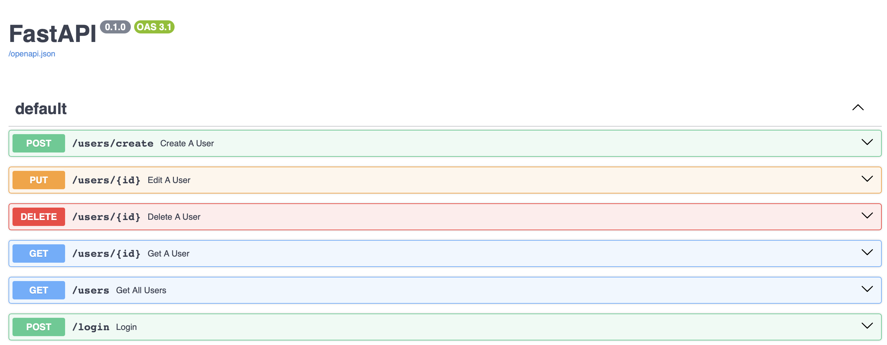
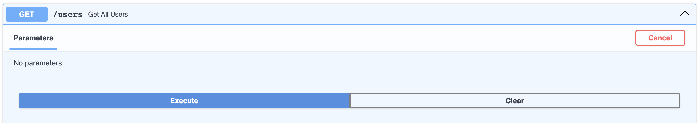
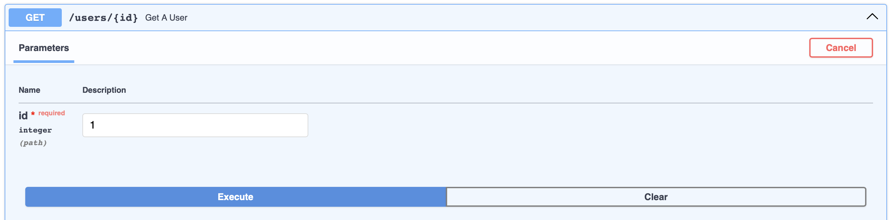
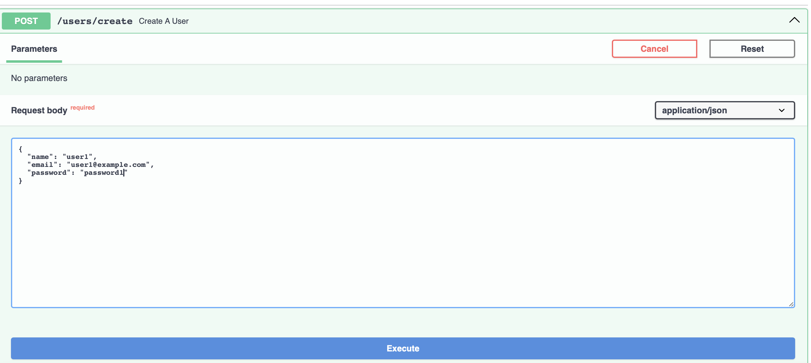
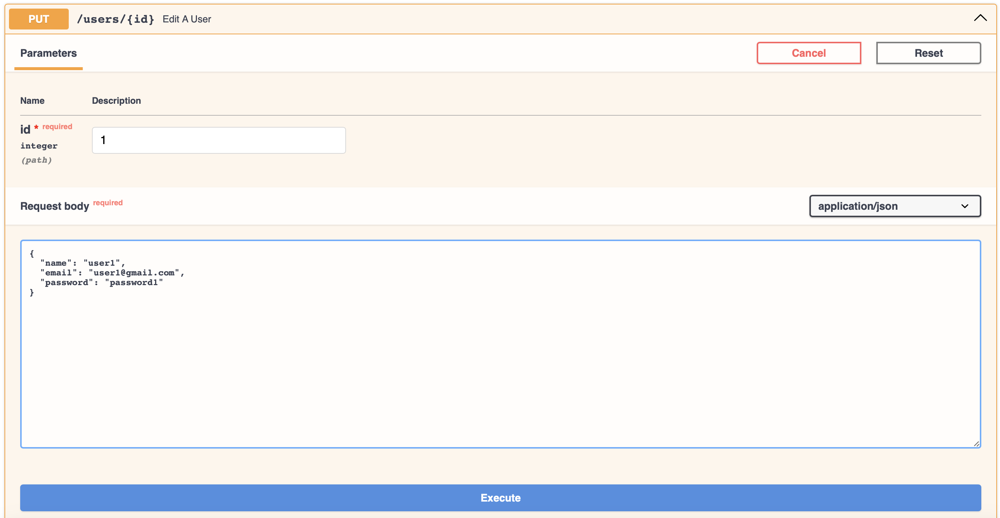
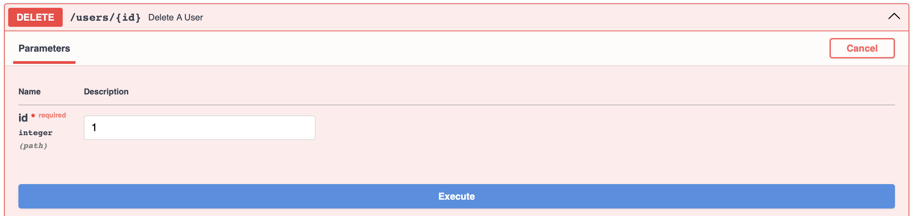
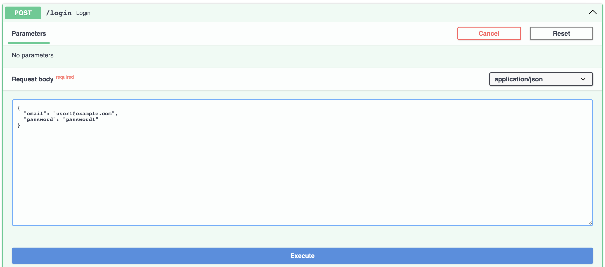

# FastAPI實作 - Admin功能

## 使用之前...
請先確認有安裝python及pip

## 複製專案到本地
1. Fork
2. git clone + 專案網址

## 初始化
```
pip install -r requirements.txt # 安裝套件
```

## pytest測試：運行前請先確認資料庫沒有資料，否則在get_all_user的比對會產生錯誤
```
pytest
```

## 啟動FastAPI伺服器
```
uvicorn main:app --reload
```

## 若看到此行訊息，即可開始進行API測試
```
Uvicorn running on http://127.0.0.1:8000 
```

<br/>
<br/>

# 如何使用API
1. 請至 http://127.0.0.1:8000/docs ，使用Swagger UI介面測試API
2. 伺服器啟動後可使用Postman測試API

## 此處使用Swagger UI介面操作
### Swagger UI首頁 (/docs)


### GET (/users) :
取得所有使用者


### GET (/users/{id})
取得一位使用者 : 輸入欲搜尋id，來獲得一位使用者


### POST (/users/create)
創立一位使用者 : 輸入name, email, password，來建立一位使用者


### PUT (/users/{id})
編輯一位使用者 : 輸入欲編輯id，輸入name, email, password，來編輯一位使用者


### DELETE (/users/{id})
刪除一位使用者 : 輸入欲刪除id，來刪除一位使用者


### POST (/login)
使用者登入 : 輸入email, password，來執行使用者登入


<br>

# 開發工具
- Python 3.9.7
- FastAPI 0.110.0
- Uvicorn 0.27.1
- Bcrypt 4.1.2
- Pytest 8.0.2
- Httpx 0.27.0